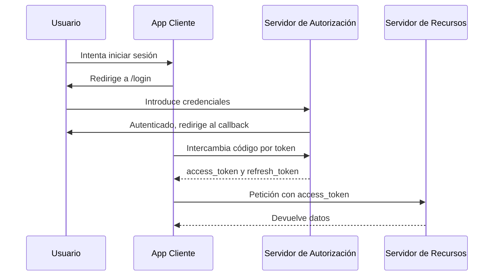

# 3.2 APIs seguras y Autenticación

## OAuth 2.0 y OpenID Connect

### Flujo de autorización con PKCE (Authorization Code Flow + PKCE)



### PKCE en cliente (React) y servidor (Node.js)

El código y ejemplos pueden mantenerse en inglés para claridad técnica.

```jsx
// React: generate code_verifier & code_challenge, redirect to authorize...
```

```javascript
// Node.js: /authorize, /token, verify JWT, etc.
```

## Cabeceras de seguridad para APIs

Ejemplo con Helmet (Node.js):
```javascript
const express = require('express');
const helmet = require('helmet');

const app = express();
app.use(helmet());

app.use(
  helmet.contentSecurityPolicy({
    directives: {
      defaultSrc: ["'self'"],
      scriptSrc: ["'self'", "https://apis.google.com"],
      styleSrc: ["'self'", "'unsafe-inline'"],
      imgSrc: ["'self'", "data:"],
      objectSrc: ["'none'"],
      upgradeInsecureRequests: []
    }
  })
);
```

## Buenas prácticas para APIs

- Validación de entradas en servidor
- Rate limiting
- Gestión segura de errores (sin filtrar datos sensibles)
- Logs con niveles y sin secretos

```javascript
// express-validator, rate-limit, error handler ...
```

## Ejercicio práctico

1. Implementa OAuth 2.0 + PKCE en tu app
2. Configura CSP y prueba en modo Report-Only
3. Escanea tu API con OWASP ZAP o Burp Suite
4. Añade rate limiting en endpoints críticos

## Próximos pasos

- [Herramientas prácticas y evaluación de seguridad](tresnak.md)
- [Volver a la sección anterior](datu_sentikorrak.md)
